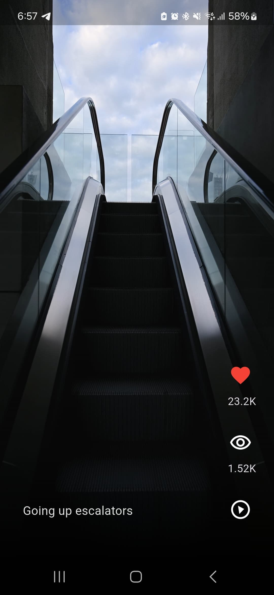
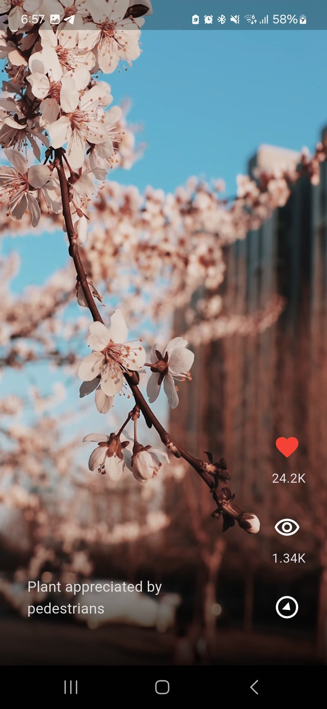

# 📱 TokTik - TikTok Clone App

Welcome to TokTik, a Flutter-based application that replicates the core video feed functionality of TikTok. This app is built using Clean Architecture principles to ensure a scalable, maintainable, and testable codebase. The app allows users to scroll through a vertical feed of short videos, similar to TikTok's interface.

## Features

- **Vertical Video Feed**: Seamlessly scroll through a feed of short videos.
- **Clean Architecture**: The app is structured using Clean Architecture principles, separating concerns into distinct layers.
- **Customizable Theme**: Easily customize the app's theme using the config/theme folder.
- **Local Video Playback**: Videos are stored locally in the assets/videos folder and played using the video_player package.
- **State Management**: Utilizes the provider package for efficient state management.

## Screenshots

 


## Requirements

- Flutter SDK (version 3.0.0 or higher)
- Dart (version 2.17.0 or higher)
- 8 video files (download from [Pexels Free Videos](https://www.pexels.com/search/videos/vertical/))

## Installation

1. **Clone the repository**:
   ```bash
   git clone https://github.com/lauritaila/tok_tik_app.git
2. **Navigate to the project directory**:
   ```bash
   cd tok_tik_app
3. **Download and add videos**:
- Download 8 vertical videos from [Pexels Free Videos](https://www.pexels.com/search/videos/vertical/)
- Rename the videos as 1.mp4, 2.mp4, ..., 8.mp4.
- Place them in the assets/videos folder.

4. **Install dependencies**:
   ```bash
   flutter pub get
5. **Run the app**:
   ```bash
   flutter run

## Project Structure (Clean Architecture Inspired)

The app follows a basic structure inspired by Clean Architecture, separating concerns into layers:

```
tok_tik_app/
├── lib/
│   ├── main.dart               # Entry point of the application
│   ├── config/                 # Configuration and utilities
│   │   ├── theme/              # App theme (colors, fonts, etc.)
│   │   └── helpers/            # Helper functions and utilities
│   ├── domain/                 # Domain layer (business logic)
│   │   ├── datasources/        # Data sources interfaces
│   │   ├── repositories/       # Repository interfaces
│   │   └── entities/           # Business entities (core data structures)
│   ├── infrastructure/         # Infrastructure layer (data sources and models)
│   │   ├── datasources/        # Implementation of data sources
│   │   ├── models/             # Data models (e.g., video models)
│   │   └── repositories/       # Implementation of repositories
│   ├── presentation/           # Presentation layer (UI and state management)
│   │   ├── screens/            # App screens (pages)
│   │   ├── widgets/            # Reusable UI components
│   │   └── providers/          # State management (using Provider)
│   └── shared/                 # Shared resources (e.g., local data)
├── assets/                     # Static assets (e.g., videos)
│   └── videos/                 # Folder containing video files
├── test/                       # Unit and widget tests
└── pubspec.yaml                # Project dependencies
```

### How the Layers Work Together:

1. **`domain/entities/`**: Define the core business entities.
2. **`domain/repositories/`**:Define repository interfaces for data access.
3. **`infrastructure/models/`**: Map API responses (or other data sources) to the domain entities.
4. **`infrastructure/datasources/`**: Map data to domain entities (e.g., VideoModel).
5. **`infrastructure/repositories/`**: Implement repository interfaces.
6. **`presentation/providers/`**: Use `Provider` to manage app state.
7. **`presentation/screens/`**: Display the UI and interact with the state managed by the providers.
8. **`config/`**: Provides global configurations and utilities used across the app.

---

This structure ensures a clean separation of concerns, making the app easier to maintain, test, and scale.

## Dependencies

- [animate_do](https://pub.dev/packages/animate_do): Adds animations to the UI.
- [intl](https://pub.dev/packages/intl ): Provides internationalization and localization utilities.
- [video_player](https://pub.dev/packages/video_player): A Flutter plugin for playing videos.
- [provider](https://pub.dev/packages/provider): A state management library for Flutter, used to manage and share app state efficiently.

## Contributing
Contributions are welcome! If you have any ideas to improve the app, please open an issue or submit a pull request.
